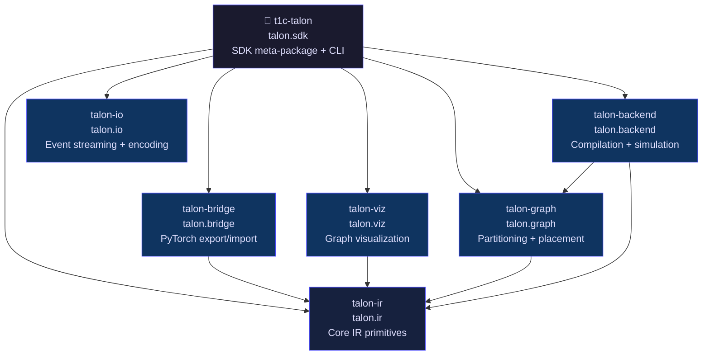
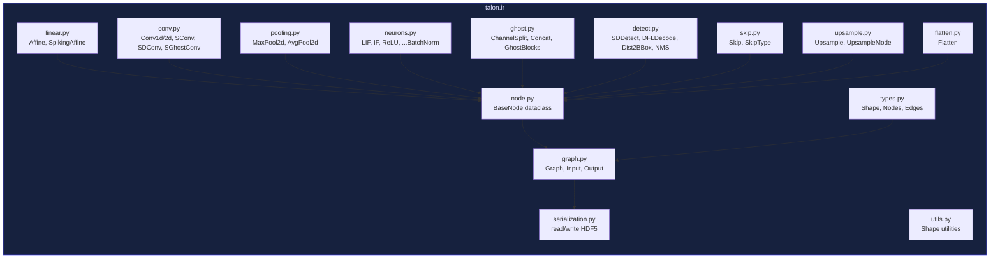
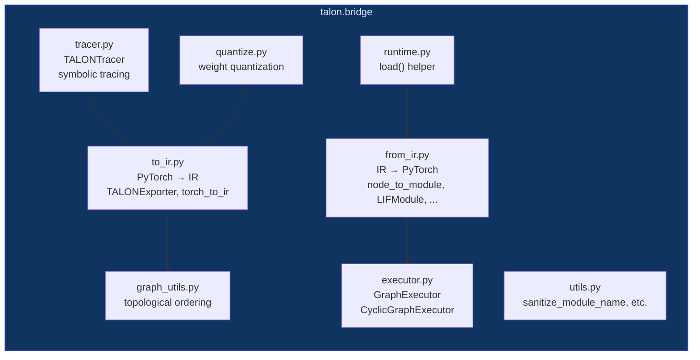
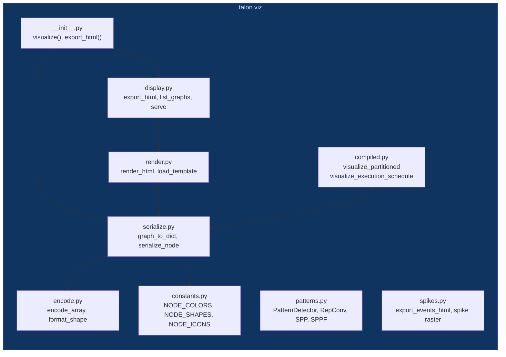
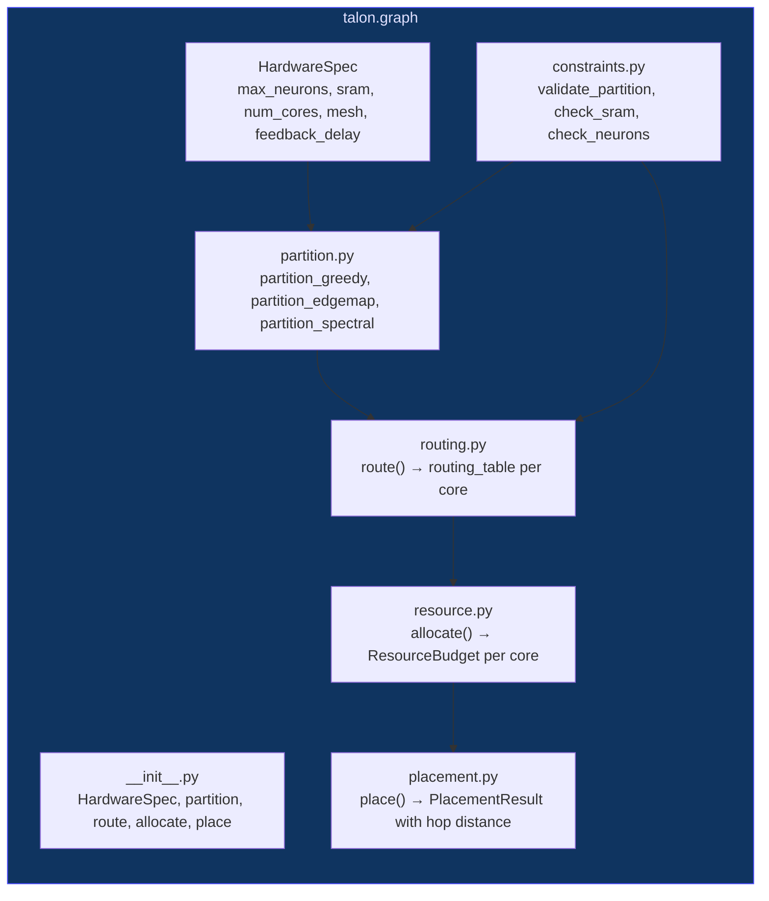
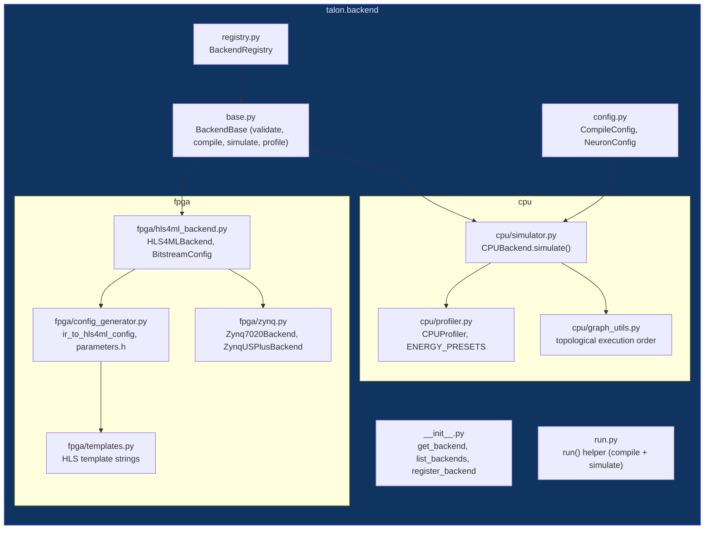
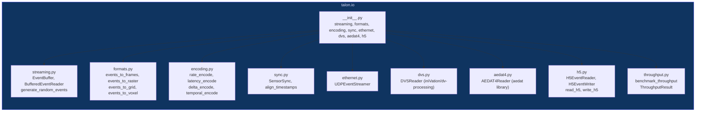
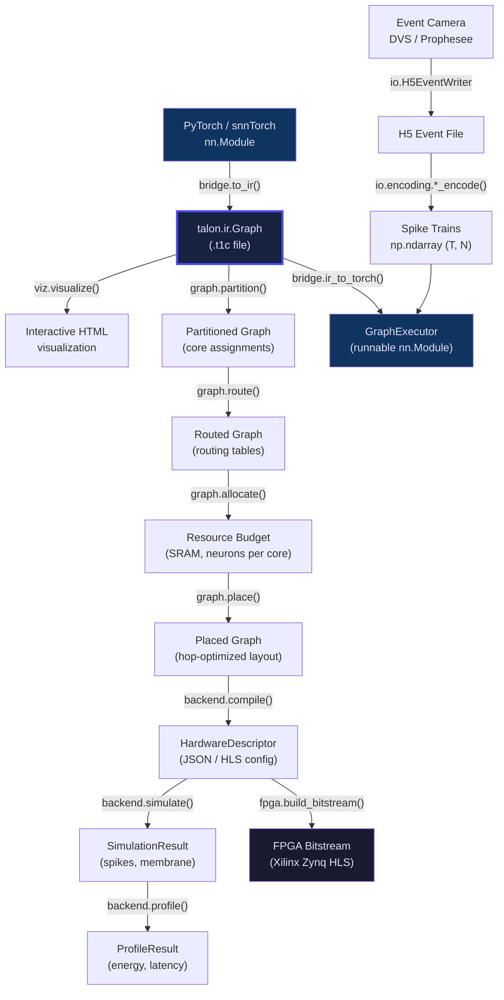

# Architecture

## System Overview

TALON is a neuromorphic computing SDK built around a layered package architecture. Each package has a single responsibility and depends only on packages below it in the stack.



**Dependency rules:**
- `talon.ir` has no dependency on PyTorch, visualization, or hardware
- `talon.bridge` imports `talon.ir`; the reverse is never allowed
- `talon.viz` imports `talon.ir`; does not import `talon.bridge`
- `talon.graph` imports `talon.ir` for node type inspection
- `talon.backend` imports `talon.ir` and `talon.graph`
- `talon.io` is fully independent; handles event data without any IR dependency
- `talon.sdk` imports all packages and re-exports a unified API

---

## Package Dependency Map

```
                          ┌──────────────────────────────┐
                          │         talon.ir              │
                          │  (numpy, rustworkx, h5py)    │
                          └──────────────┬───────────────┘
                                         │
        ┌────────────┬───────────────────┼────────────┬────────────┐
        │            │                   │            │            │
        ▼            ▼                   ▼            ▼            │
 ┌────────────┐ ┌─────────┐ ┌──────────────┐ ┌──────────┐        │
 │talon.bridge│ │talon.viz│ │  talon.graph │ │ talon.io │        │
 │ (torch)    │ │(pillow) │ │(numpy,scipy) │ │ (numpy)  │        │
 └────────────┘ └─────────┘ └──────┬───────┘ └──────────┘        │
                                    │                              │
                                    ▼                              │
                            ┌──────────────┐                      │
                            │talon.backend │◄─────────────────────┘
                            │(numpy)       │
                            └──────────────┘

              ┌────────────────────────────────────────────┐
              │                 talon.sdk                   │
              │          (all packages + click, rich)       │
              └────────────────────────────────────────────┘
```

---

## talon.ir: Core IR

The foundation layer. All other packages depend on it; it depends on nothing from the TALON stack.



### Primitive Categories

TALON IR provides 36 primitives across 8 categories:

| Category | Primitives |
|----------|-----------|
| Linear | Affine, SpikingAffine |
| Convolution | Conv1d, Conv2d, SepConv2d, SConv, SDConv, SGhostConv |
| Spatial | MaxPool2d, AvgPool2d, Upsample, Flatten |
| SNN Neurons | LIF, IF |
| ANN Activations | ReLU, Sigmoid, Tanh, Softmax, GELU, ELU, PReLU |
| Normalization | BatchNorm1d, BatchNorm2d, LayerNorm, Dropout |
| Routing | ChannelSplit, Concat, Skip, HybridRegion |
| Ghost/Detection | SGhostEncoderLite, GhostBasicBlock1/2, SDDetect, DFLDecode, Dist2BBox, NMS |

### Graph Lifecycle

```
Define nodes dict + edges list
        ↓
ir.Graph(nodes, edges)      ← rustworkx DAG, validated on construction
        ↓
ir.write('model.t1c', graph)  ← HDF5, all params as datasets
        ↓
ir.read('model.t1c')          ← deserializes back to Graph
```

---

## talon.bridge: PyTorch Bridge

Bidirectional conversion between PyTorch `nn.Module` objects and `talon.ir.Graph`.



### Export Flow (PyTorch → IR)

```
nn.Module
    │
    ├── TALONTracer (symbolic trace)
    │       └── captures module graph, shapes, dtypes
    │
    ├── node_converter (module → IR node)
    │       └── Linear → Affine, Conv → Conv2d, snn.Leaky → LIF, ...
    │
    └── ir.Graph(nodes, edges)
```

### Import Flow (IR → PyTorch)

```
ir.Graph
    │
    ├── node_to_module (IR node → nn.Module)
    │       └── Affine → Linear, LIF → LIFModule, SDConv → DepthwiseConv2d, ...
    │
    ├── GraphExecutor
    │       ├── topological sort of nodes
    │       ├── routes tensors along edges during forward()
    │       └── handles multi-output nodes (ChannelSplit → tuple)
    │
    └── CyclicGraphExecutor (for recurrent/SNN graphs)
            └── carries hidden state across timesteps
```

### Multi-Output Routing

`ChannelSplit` nodes are marked with `_is_multi_output = True`. The `GraphExecutor` uses a set of such node names to correctly route tuple outputs without treating them as hidden state:

```python
from talon import ir, bridge
import numpy as np

split = ir.ChannelSplit(split_sections=[8, 8], dim=1)
concat = ir.Concat(num_inputs=2, dim=1)

graph = ir.Graph(
    nodes={'x': ir.Input(...), 'split': split, 'concat': concat, 'y': ir.Output(...)},
    edges=[('x', 'split'), ('split', 'concat'), ('split', 'concat'), ('concat', 'y')]
)
executor = bridge.ir_to_torch(graph)
```

---

## talon.viz: Visualization

Generates self-contained HTML visualizations using D3.js and Dagre. No server required.



### Visualization Pipeline

```
ir.Graph
    │
    ├── graph_to_dict()       ← JSON-serializable representation
    │       ├── serialize_node() per node (type, shape, params, color, icon)
    │       └── detect_all_patterns() (RepConv, SPP, skip connections, fan-out)
    │
    ├── render_html()         ← inject graph_dict into Jinja2 template
    │       └── viewer.html template with D3.js + Dagre
    │
    └── export_html() / serve()
```

### Pattern Detection

```
PatternDetector.detect_all_patterns(graph)
    ├── detect_repconv_patterns()      → RepConv blocks
    ├── detect_spp_patterns()          → Spatial Pyramid Pooling
    ├── detect_sppf_patterns()         → Fast SPP (YOLOv8 style)
    ├── detect_skip_connection_patterns() → residual / concatenate skips
    ├── find_fan_out_points()          → nodes with multiple output branches
    └── find_merge_points()            → nodes with multiple inputs
```

---

## talon.graph: Partitioning and Placement

Maps IR graphs onto neuromorphic hardware meshes.



### Partitioning Algorithms

| Algorithm | Strategy | Best For |
|-----------|----------|---------|
| `partition_greedy` | BFS-order, fill cores sequentially | Dense feedforward networks |
| `partition_edgemap` | Minimize cross-core edges greedily | Networks with many skip connections |
| `partition_spectral` | Graph Laplacian spectral bisection | Balanced partitions on complex topologies |

### Core Metrics

```
Core utilization  = layer_sram_bytes / sram_bytes_per_core
Hop distance      = Σ manhattan_dist(src_core, dst_core) over cross-core edges
PlacementResult.improvement = (baseline_hops - placed_hops) / baseline_hops
```

---

## talon.backend: Compilation and Simulation

Compiles IR graphs to hardware descriptors and simulates execution on CPU and FPGA targets.



### Simulation Pipeline

```
ir.Graph + CompileConfig
    │
    ├── validate()     ← check all node types are supported
    ├── compile()      ← produce HardwareDescriptor (JSON/dict)
    ├── simulate()     ← CPU forward pass for n_steps timesteps
    │       └── returns SimulationResult (outputs, spikes, membrane per core)
    └── profile()      ← SimulationResult + energy estimation
            └── returns ProfileResult with .summary() formatted string
```

### Energy Presets

```
ENERGY_PRESETS = {
    "45nm_cmos":           {mac_pj: 1.0,  spike_pj: 0.1,  sram_pj: 2.0}
    "zynq_7020":           {mac_pj: 4.5,  spike_pj: 0.5,  sram_pj: 8.0}
    "zynq_us_plus":        {mac_pj: 3.2,  spike_pj: 0.35, sram_pj: 6.0}
    "neuromorphic_int8":   {mac_pj: 0.08, spike_pj: 0.03, sram_pj: 0.5}
    "t1c_asic_target":     {mac_pj: 0.05, spike_pj: 0.02, sram_pj: 0.3}
}
```

---

## talon.io: Event Streaming and Encoding

Handles neuromorphic event data I/O, neural spike encoding, and sensor integration. Fully independent of `talon.ir`.



### Event Data Model

```python
EVENT_DTYPE = np.dtype([
    ('t', np.int64),    # timestamp in microseconds
    ('x', np.int16),    # pixel x coordinate
    ('y', np.int16),    # pixel y coordinate
    ('p', np.int8),     # polarity: 0 (OFF) or 1 (ON)
])
```

### Encoding Schemes

| Scheme | Description | Output Shape |
|--------|-------------|-------------|
| `rate_encode` | Poisson spike train from firing rate | `(T, N)` |
| `latency_encode` | Single spike at time proportional to intensity | `(T, N)` |
| `delta_encode` | Spike on pixel value change | `(T, H, W, 2)` |
| `temporal_encode` | Threshold-crossing temporal codes | `(T, N)` |

---

## talon.sdk: SDK Meta-Package

`talon.sdk` is the unified entry point. It re-exports the full API of all six sub-packages plus SDK-specific tools.

```mermaid
graph TD
    subgraph "talon.sdk (t1c-talon)"
        Init["__init__.py<br/>re-exports all sub-packages"]
        CLI["cli.py<br/>talon / t1c CLI<br/>analyze, profile, lint, compare,<br/>inspect, validate, convert,<br/>pipeline, energy, run"]
        Analyze["analyze.py<br/>analyze_graph() → GraphStats"]
        Profile["profile.py<br/>profile_graph() → HardwareProfile"]
        Lint["lint.py<br/>lint_graph() → LintResult"]
        Compare["compare.py<br/>compare_graphs(), assert_graphs_equal()"]
        Convert["convert.py<br/>convert_to_spiking(), quantize_weights()"]
        Query["query.py<br/>inspect_node(), find_pattern()"]
        Fingerprint["fingerprint.py<br/>fingerprint_graph(), stamp_graph()"]
        Energy["energy.py<br/>estimate_energy() → EnergyEstimate"]
        Pipeline["pipeline.py<br/>TALONPipeline (partition+compile+run)"]
        Visualize["visualize.py<br/>TALONVisualizer (rich terminal + HTML)"]
        Version["version.py<br/>get_versions() → {talon.* : ver}"]
        Main["__main__.py<br/>python -m talon.sdk"]
    end

    Init --> Analyze
    Init --> Profile
    Init --> Lint
    Init --> Compare
    Init --> Convert
    Init --> Query
    Init --> Fingerprint
    Init --> Energy
    Init --> Pipeline
    Init --> Visualize
    Init --> Version
    CLI --> Analyze
    CLI --> Profile
    CLI --> Lint
    CLI --> Pipeline
    Main --> CLI

    style "talon.sdk (t1c-talon)" fill:#1a1a2e,color:#e0e0ff,stroke:#4a4aff
```

### CLI Commands

```
talon --help          # Show all commands
talon info            # Ecosystem version table
talon primitives      # List all 36 IR primitives

talon analyze  <model.t1c>          # Layer stats, parameter counts
talon profile  <model.t1c>          # Latency/memory/energy estimation
talon lint     <model.t1c>          # Validate IR constraints
talon compare  <a.t1c> <b.t1c>      # Diff two graphs
talon inspect  <model.t1c> --json   # JSON node/edge dump
talon validate <model.t1c>          # Quick validity check

talon convert  <model.t1c> --to spiking  # ANN → SNN conversion
talon energy   <model.t1c>               # Energy breakdown
talon run      <model.t1c> --steps 10    # CPU simulation
talon pipeline <model.t1c>               # Full partition+compile+run
```

---

## Full System Data Flow

End-to-end workflow from PyTorch model to hardware deployment:



---

## Design Decisions

### Why HDF5?

- Efficient storage of large weight matrices (float16/32/64, int8/16/32)
- Self-describing format with embedded metadata and version info
- Wide language support (Python, C++, MATLAB, Julia)
- Compression support for deployment on embedded targets
- Compatible with myhdf5.hdfgroup.org web viewer for inspection

### Why Separate Packages?

| Concern | Benefit |
|---------|---------|
| Dependency isolation | `talon.ir` works without PyTorch; `talon.io` works without `talon.ir` |
| Independent versioning | IR can evolve separately from framework bindings |
| Clear ownership | Different teams own different packages |
| Focused testing | Each package has its own test suite (327 + 171 + 162 + 61 + 96 + 63 + 142 = 1022 tests) |
| Deployment flexibility | Hardware teams only need `talon.ir` + `talon.backend`, not PyTorch |

### Why Namespace Packages?

All packages share the `talon` namespace:

```python
from talon import ir, bridge, viz, sdk
from talon.ir import Graph, LIF, Conv2d
from talon.backend import get_backend
```

This allows the full ecosystem to feel like a single library (`talon`) while still being independently installable packages (`talon-ir`, `talon-bridge`, etc.). The SDK meta-package (`t1c-talon`) pulls in everything.

### Talon Package Manifest

| PyPI Package | Python Namespace | Repository |
|-------------|-----------------|------------|
| `talon-ir` | `talon.ir` | t1cir |
| `talon-bridge` | `talon.bridge` | t1ctorch |
| `talon-viz` | `talon.viz` | t1cviz |
| `talon-graph` | `talon.graph` | t1cgraph |
| `talon-backend` | `talon.backend` | t1cbackend |
| `talon-io` | `talon.io` | t1cio |
| `t1c-talon` | `talon.sdk` | t1c-sdk |
